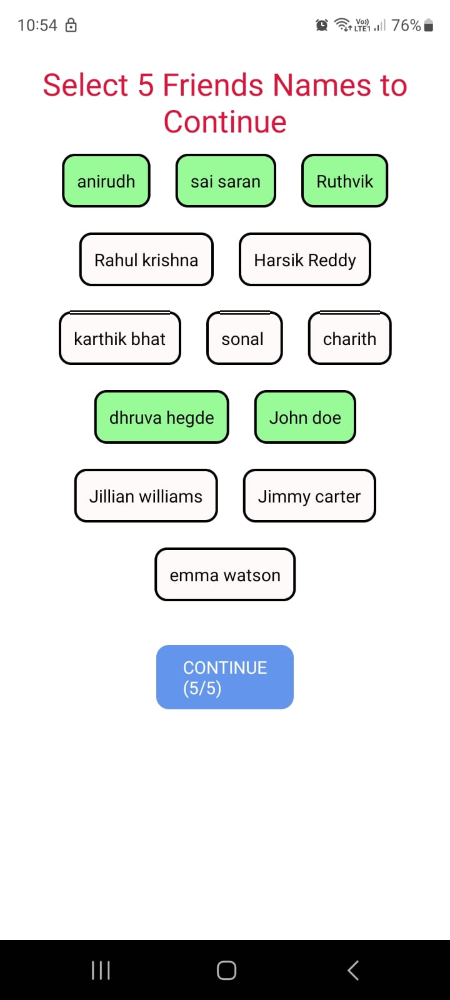

<ol>
<li>Create Friends Screen</li>
<li>List of Friends should not be static. Use them from an object</li>
<li>After each selection of Friend the buttons text should change like: 1/5, 2/5 and so on.</li>
<li>After selection of 5 Friends button should show as Continue or else button should be disabled!</li>
</ol>

